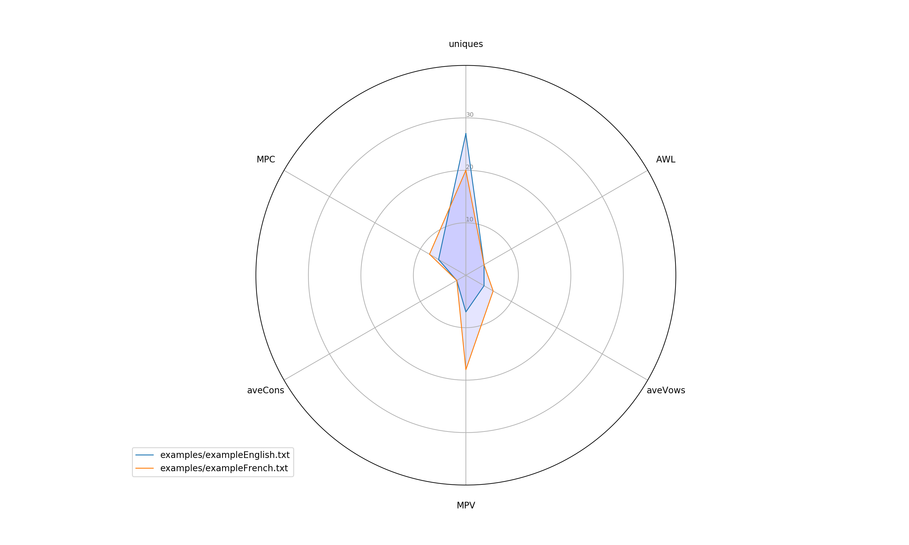

# textCharacter
*Python2*[^1] based text analyser.

**Requirements**
* matplotlib.pyplot
* numpy
* time
* argparse
* operator
* character

[^1] May work with *Python3* but not tried

## Motivation
*How to compare different languages in text form?*

Compare text across a few (European) languages: English, Dutch, French, German.

1. Make text file in English
2. Translate file to different (European) languages using [Google translate](https://translate.google.co.uk)
3. Use *character.py* to characterise individual text file
4. Use *compare.py* to compare (via characterisation) across text files in different languages

## Characterisation
*How to characterise text?*

Invent metric for comparison:
* average word length (`AWL`)
* total characters in text
* total unique characters (`uniques`)
* average vowel frequency (`aveVows`)
* average consonant frequency (`aveCons`)
* most popular vowel
* most popular vowel frequency (`MPV`)
* most popular consonant
* most popular consonant frequency (`MPC`)
* frequency of each character (first order)
* frequency of character combinations (second order)

Plot:
* histogram of frequency (basic)
* some kind of combined characterisation plot (TBC)
    * some convoluted subset of metric??
    * some multi-dimensional plot of subset of metric??

## Next steps
*Can the characterisation metric be used to train machine to distinguish languages?*

**To do**
Write code for ML
* train algorithm
* apply to test files

---
## Usage

Guide to using code elements

### Single text file characterisation

**Command**
`character.py`

| Args | Comment (default) | e.g. |
| --- | --- | --- |
| infile | input filename (not set) |  english.txt |
| plot | showplots (1) | 1 |

*E.g.*
> python character.py --infile english.txt --plot 1

**_Comments_**
Example output:
```
('total # characters:', 69)
('total unique characters:', 27)
('average vowel frequency:', 4)
('average consonants frequency:', 2)
('most popular vowels (7):', ['e'])
('most popular consonants (6):', ['s'])
('average word length:', 4)
```


**Command**
`character.py`

| Args | Comment (default) | e.g. |
| --- | --- | --- |
| infile | input filename (not set) |  english.txt |
| plot | showplots (1) | 1 |

*E.g.*
> python character.py --infile english.txt --plot 1

**_Comments_**

### Multiple text file comparison

**Command**
`compare.py`

| Args | Comment (default) | e.g. |
| --- | --- | --- |
| infiles | input filenames (not set) |  english.txt french.txt |
| plot | showplots (1) | 1 |

*E.g.*
> python character.py --infiles english.txt french.txt --plot 1

**_Comments_**
Example output:
```
### Comparison Table
                       group  uniques  AWL  aveVows  MPV  aveCons  MPC
 examples/exampleEnglish.txt       27    4        4    7        2    6
  examples/exampleFrench.txt       20    4        6   18        2    8
```

